# Threads
Threads is intended to provide support for professionals, too busy living life to worry about what they should wear. The site targets people who want to maximise their freedom of living, and to minimise stress of dressing for it.

In the sign up form, a brochure can be requested with all the details for ordering. This will ensure that marketing can be optimised with carefully targeted campaigns - avoiding information overload for our customers. 

The site is responsive to viewing on mobiles, tablets, laptops, and desktops.

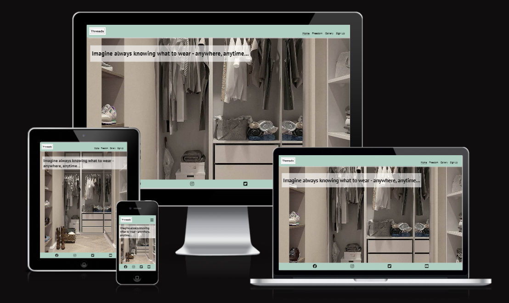

 View Threads Cross-over Capsule live project [here](https://caylindewey.github.io/cross-over-capsule-102/).

## Table of Contents
- [User Stories UX](#user-stories-ux)
    - [First-time Visitor Goals](#first-time-visitor-goals)
    - [Returning Visitor Goals](#returning-visitor-goals-scalability-and-future-proof)
    - [Frequent User Goals](#frequent-user-goals)

    - [User Experience Centered Design](#user-experience-centered-design)
    - [User Experience Scalability](#user-experience-scalibility)
    - [User Return Experience Future Proof](#user-return-exprience-future-proof)
    - [Imagery](#imagery)   
- [Features](#features)
    - [Existing Features]()
     
    - [Future Implementations](#future-implementations)
        - [Minimal Viable Product](#minimal-viable-product)
        - [Browser Testing](#browser-testing)
        - [Chrome Dev Tools Lighthouse Scores](#chrome-dev-tools-lighthouse-scores)
        - [Content for Marketing](#content-for-marketing-on-the-site)
        - [Accessibility and Color Contrasts](#accessibility--color-contrasts)
        - [Readme File Improvements](#readme-file-improvements)
- [Technologies](#technologies-usedacknowledgements)
    - [Languages](#languages)
    - [Frameworks, Programs and Libraries](#frameworks-programs-and-libraries)
    - [Deployment](#deployment)
    - [Local Development](#local-development)
        - [How to Fork](#how-to-fork)
        - [How to Clone](#how-to-clone)
- [Testing](#testing)
    - [Workflow](#workflow)
    - [Tests](#tests)
        - [Chrome Dev Tools Responsive Testing](#chrome-dev-tools-responsive-testing)
        - [AmIResponsive](#amiresponsive)
        - [Validator HTML & CSS](#validator)
        - [Chrome Dev Tools Lighthouse](#chrome-dev-tools-lighthouse)
        - [Features of the site](#signup-form)
            - [Navigation Bar](#navigation-bar)
            - [Social Media Links](#social-media-links)
            - [Signup Form](#signup-form)
- [Support](#support)
- [Frequently Asked Questions](#frequently-asked-questions)

## User Stories UX
### User Experience 
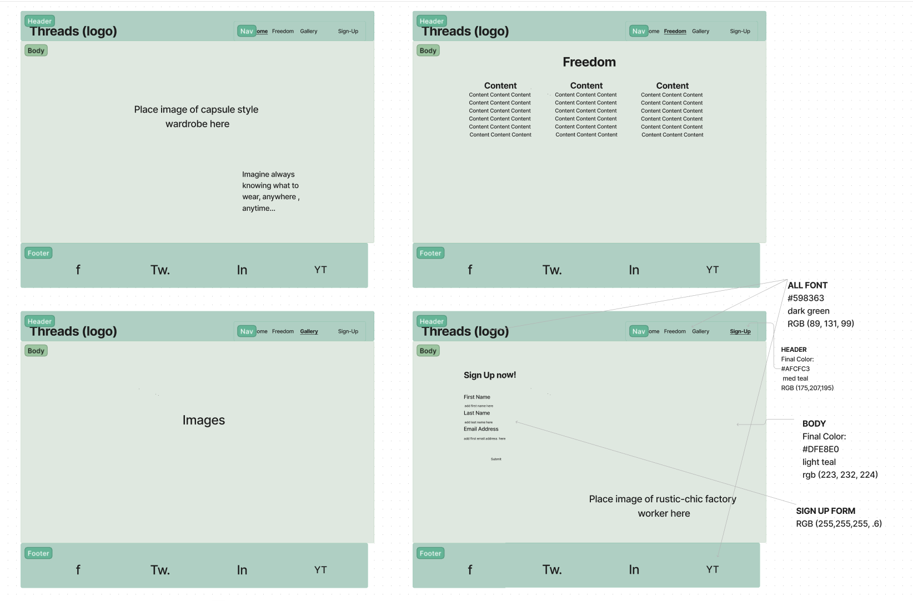 
- The site has been designed with an "easy to take in" style focussed on avoiding decision fatigue and information overload.  
- Each stroke and click is efficient and intentional.

#### First-time Visitor Goals
- Buy into the idea of owning an easy way of dressing and then sign on for a brochure. 

#### Returning Visitor Goals (Scalability and Future Proof)
- The site is scalable and will remain just as easy and simple to take in regardless of expansion and growth. 
- The focus will be on replacing product with ones - on our site - that give you more joy.  

#### Frequent User Goals
- Read about our latest product developments and ideas on the freedom page.  See how you feel in the world wearing our clothes.
- See our latest gear and styles on the gallery page.
- Sign on for the latest brochure (if we have not sent you one already).

## Features
- The site is responsive on all device sizes.
- The site entices people who want to an easy way of dressing to fill in the sign up page.
- This client information can then be used for targeted marketing campaigns as the business scales up and expands.

### Navigation Bar
- It includes all pages (home, freedom, gallery and sign up page).
- It is fixed for visibility from all pages giving you easy access going forward or backward. 
- The design is identical on all pages, promoting continuity and ease of use (trust).
- The page you are on is underlined promoting transparency (belonging).

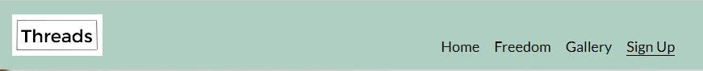

On the mobile device the navigation bar folds into a burger icon with a drop down menu. 

### Main Headings
The logo has been incorporated with the heading in keeping with the product philosophy of having less do more for you.
#### Home Page
The heading has been suggested as an idea (white transparent cloud around text) of looking at your wardrobe and knowing what to wear anytime, anywhere.
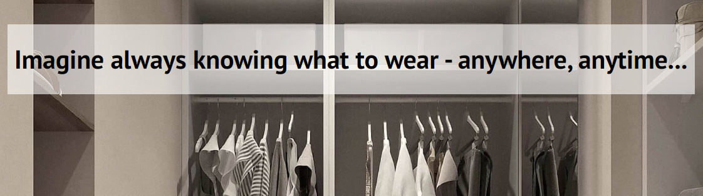

#### Footer Page
- Links to social meadia are given for the user.  This opens a new tab for easy navigation.

#### Freedom Page
Cross-Over Capsule Clothes explains the hybrid concept of this range giving the user freedom.  The minamilistic idea is promoted in the sense the the user is free to experience life more with less stress of dressing for each occasion.
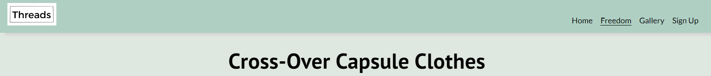

- Section One
In keeping with the ideas in which way the user will be free to experience life, these sections suggest various scenarios where life can be experienced more with joy wearing the cross-over capsule wardrobe.
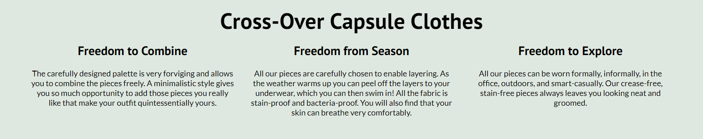

- Section Two and Three
Here the user has a more spaced out layout to take a moment and savour the experiences with our clothes.
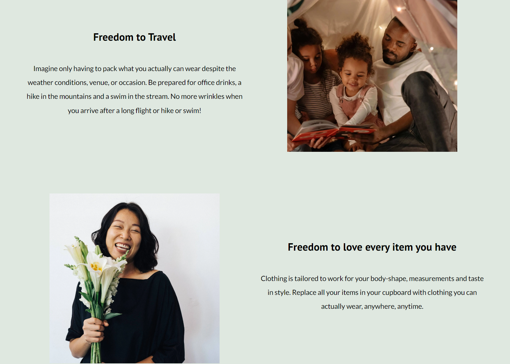

#### Gallery Page
The idea that the user can simplify life and enjoy it more is suggested by the images.
- Sign Up for a brochure now! is encapsulated in the white border again to promote the idea of signing up.  Only 3 fields make the task seem small.
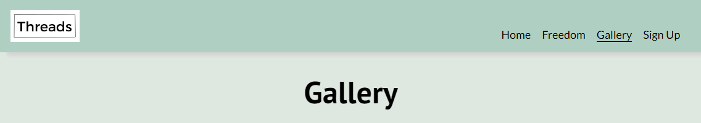

#### Signup Page
The signup heading invites the user to take action now by signing up.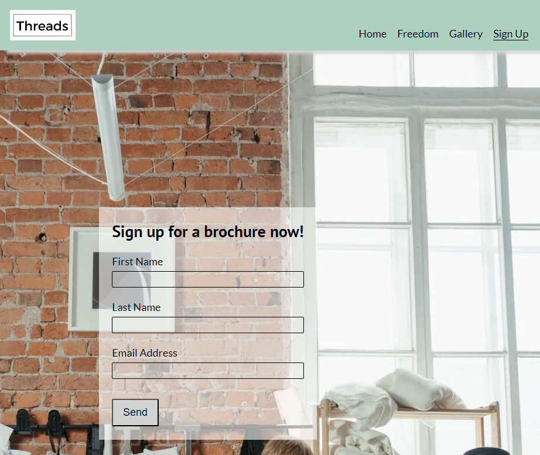

The palette was chosen from [Codespace](https://mycolor.space/) to ensure a calm, serene and welcoming user experience. As the project evolved the header and footer color was changed to conform to a palette which could be used to compile a branding package in the future. 

.

#### Imagery
The images presents the user experience as it unfolds on the navigation bar from left to right.   
- Home: Here the user is presented with the idea of looking at their wardrobe knowing what they are going to wear anywhere, anytime! [Home](assets/images/home_tablet.png)  

- Freedom: Imagine if packing could be a serene and masterful task - even to the point that your beanie matches your luggage!  [Freedom](assets/images/freedom_tablet.png)

- Supportive: The user is presented with ideas on how using this product is supportive internally as well as externally. There could be so many positive consequences of doing business on this site and being associated with this brand.  [Support](assets/images/supportive_tablet.png)

- Signup: Your orders can be processed by staff that take ethics and professionalism seriously.  [signup](assets/images/signup_tablet.png)
 
### Future Implementations
#### Minimal Viable Product
The MVP was considered with most of the work for this project. So much more content and features could be included.  Initially an order form with measurements, palette choice form, and email features were considered.  You will see remnants of some initial code referring to "palette", "mesurements", and "mail to" that stemmed from this.  One of the first rectrospectives for the project caused this change in course.  These are all improvements that can be pinned for weighting or prioritising in future user stories.

#### Browser Testing
The site could be tested in different browsers in future. It was not part of the minimal viable product for this project.

#### Chrome Dev Tools Lighthouse Scores
The scores for mobile performance especially, has been improved after a peer-review suggested this. All the new images reflecting the updated and improved tests are now [available](#chrome-dev-tools-lighthouse).

#### Content for Marketing on the Site
In future it would be great to have a few shots and clips of influencers that fit our demographic. Examples would be influencers that rate tech, travel gear, travel destinations, etc. Ideas for content could be to feature their wardrobe and what they selected and why. As product upgrades are released, these can then be reviewed for "promotion" by the influencers.

It may be prudent to keep an eye on the [Labfresh](https://labfresh.nl/) and [ninepine](https://www.ninepine.nl/) sites for inspiration. It would also be really cool to collaborate with their people, maybe even featuring their founders. This could potentially triple all three brands exposure for global marketing.  Many podcasters and influencers follow this marketing recipe.

Minimalism has a drawback that you are actually marketing the idea for the user to consume less.  By constandly upgrading and refining our product range, we can avoid this and tap into a market that very few people have managed to grow.

#### Accessibility & Color Contrasts
I would strongly recommend that more time be spent on ensuring that this site is accessible to all users and so inclusive. Many more aria-labels can be inserted.  Color contrasts can be introduced in conjunction with the standard brand palette.

#### Readme File Improvements
The readme file could containt badges and shields with up to date stats.  It could also have instructions for local development and cloning as seen on [Kera Cudmore's readme example](https://github.com/kera-cudmore/Bully-Book-Club#local-development). A branding package could be sourced to ensure all future marketing material complies to standards set.

## Technologies Used/Acknowledgements
### Languages
HTML and CSS were used to create this website.

### Frameworks, Programs and Libraries
- [Am I Responsive](https://ui.dev/amiresponsive) displays the site on a range of devices.
- [Code Institute Readme Template](Code-Institute-Solutions/readme-template) 
- [Code Institue Alumna's, Kera Cudmore, Readme Tutorial](https://github.com/kera-cudmore)
- [Code Institute Student Tutor and Mentor Support](https://learn.codeinstitute.net/ci_support/diplomainfullstacksoftwarecommoncurriculum/support)
- [Codespace](https://mycolor.space/) was used to select a color palette. Details of the color palette are on the [wireframe](assets/images/wireframe_cross-over_capsule_v1.png). 
- [Favicon](https://favicon.io/favicon-converter/) was used to create the favicon
- [Figjam](https://www.figma.com/) was used for the wireframe
- [Font Awesome](https://fontawesome.com/v4/icons/) was used for all icons
- [Google Fonts](https://fonts.google.com/) was used to imports fonts to the website
- [Git](https://git-scm.com/) was used for version control
- [Github](https://github.com/) was used to save and store files
- [Lightshot](https://app.prntscr.com/en/index.html) was used for screendumps

### Deployment
Github was used to deploy this site.  The steps are as follows:
1. Log into the [Github site](https://github.com/)
2. Pull up the repository for [Cross-over Capsule](https://github.com/CaylinDewey/cross-over-capsule-102)
3. Select the settings link, then the pages link.
4. In the source section choose 'main' from the dropdown menu.  
5. Select the 'root' from the drop menu and 'save'.
6. The URL that is displayed should have your live Github pages site. 

### Local Development
#### How to Fork
1. Log into the [Github site](https://github.com/)
2. Pull up the repository for [Cross-over Capsule](https://github.com/CaylinDewey/cross-over-capsule-102)
3. Use to [fork button](assets/images/github_fork.png) on the top right hand corner 

#### How to Clone
1. Log into the [Github site](https://github.com/)
2. Click on the burger menu that will open up the repositories you are working on at the bottom.  Select the project you need.
3. Click on the clone button and select from HTTPS, SSH, or GitHub CLI.  Then copy the link shown.
4. Open your code editor terminal and change the current work directory to the location you want to use for the cloned directory.
5. Type in the terminal 'git clone' and paste your link here. 

## Testing
### Workflow
At various stages of the project, feedback was gained and changes made to:
- Navigation item Freedom was initially a palette tab. It was recommended that I focus on user experience instead of a sales pitch. I was quote with the idea that if you want someone to sail with you, you need to get them to fall inlove with open waters and not pitch the actual ship tasks to them.
- Navigation item Supportive was initially a measurements tab. Once again, this mundane task was replaced with an almost Steve Jobs pitch of internal as well as external idealism.
- Several refinements had to be made for responsiveness throughout the project, for mobile, tablet, laptop and desktop.  The mobile Galaxy Fold, and the Tablet Mac Air, was used.
- There was a concern that the signup tab form dissappeared behind the white bits of the underlying image. A vote was made by concerned opionators and it was decided to leave it for now.
- Halfway through the project I ran out of Codeanywhere hours and had to switch to Gitpod.  The Code Institute Tutor had me working on Gitpod within a day - so efficient!!
- In response to the peer-review the logo and name of the site was changed from "Cross-over Capsule" to "Threads".

### Tests
#### Solved Bugs
Initially the images were not compressed enough for fast loading.  The image on the 'Supportive'page had to be replaced.  All images are now compressed for faster loading.

#### Chrome Dev Tools Responsive Testing
From the inception of the project all code was written for the mobile (Galaxy Fold), then tested on bigger devices. Media queries were created to ensure that the site is responsive to all 4 devices.

#### AmIResponsive
At the end of the project the final test was done on this [site](assets/images/responsive-results.png).

#### Validator
All HTML and CSS pages were tested.  Most of the bugs found were syntax bugs that were easily resolved.  Errors were thus corrected until there were no errors.

#### Chrome Dev Tools Lighthouse
The following scores for mobile were recorded:
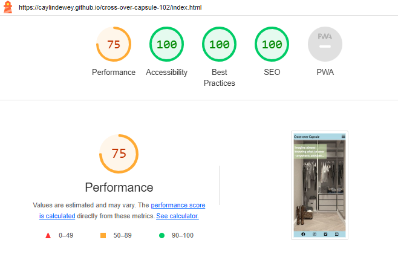
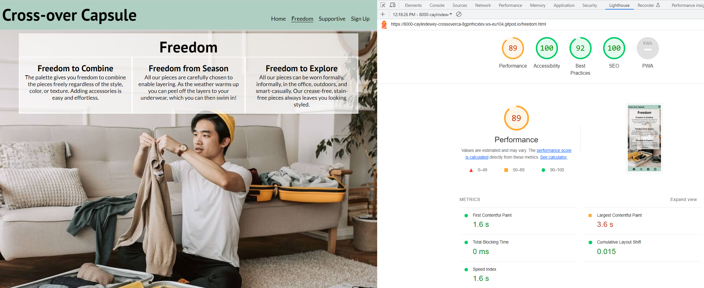
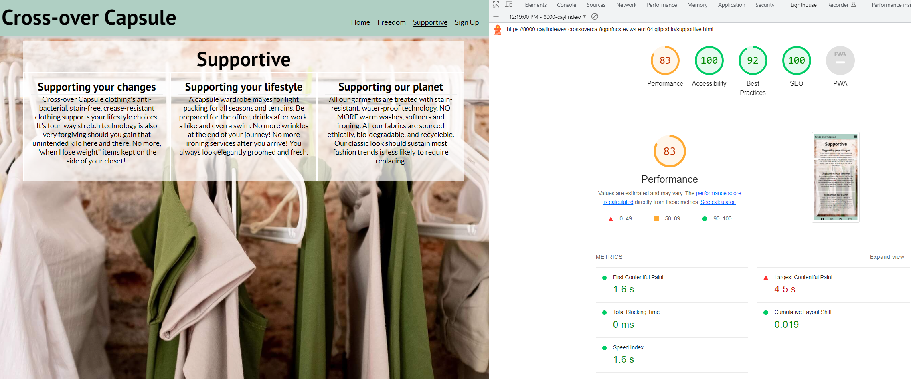
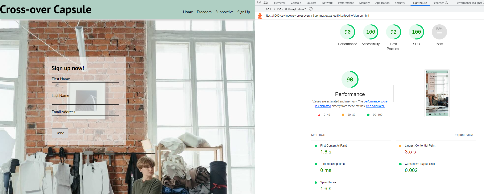

The following scores for desktop were recorded:
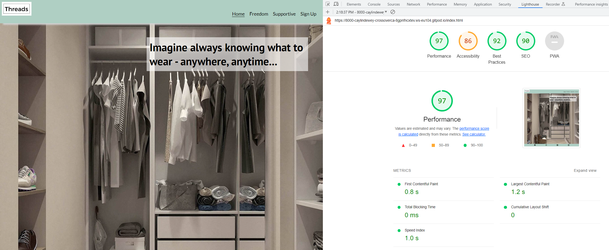

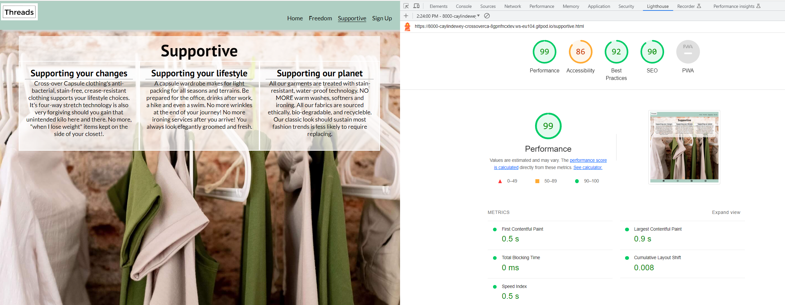
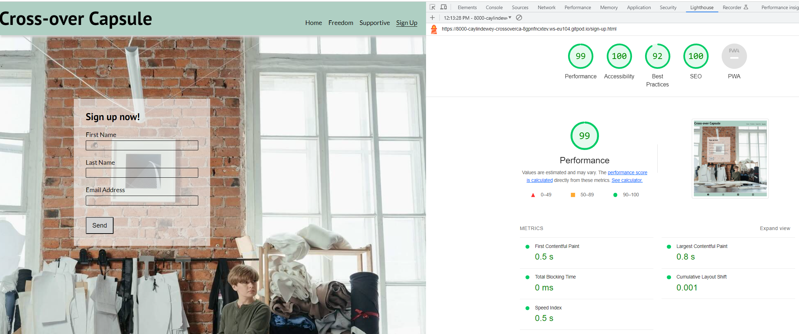

Mention was made in future implementation to review the necessity of a better score, especially for the mobile performance before time is allocated for this.  

#### Features of the site
##### Navigation Bar
The navigation bar links were tested. Hovering and grabbing features are working. The page title is underlined to show which page you have selected. Aria-labels are included in all links.

##### Social Media Links
All social media links in the footer work. Aria-labels are included in all links.

##### Signup Form
The [signup form](assets/images/signup_data_dump.png) data was submitted correctly. [Errors](assets/images/signup_errs.png) messages prevent forms with invalid data being submitted. 

## Support
Please contact me for support 24/7 on email wishful@thinking.com or join our Slack channel.

## Frequently Asked Questions
This section will be populated as social media comments and interaction is generated.

