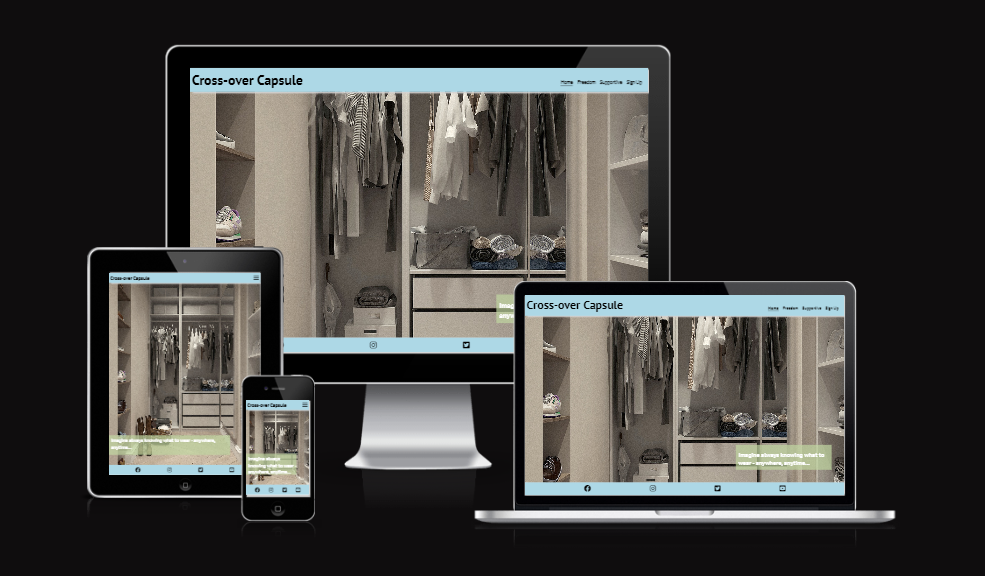

# Cross-over Capsule
Cross-over Capsule is intended to provide a support for professionals too busy living life to worry about what they should wear. The site targets people who want to maximise their freedom of living and to minimise stress.

The site is responsive to viewing on mobiles, tablets, laptops, and desktops. View on Cross-over Capsule on [Github](https://caylindewey.github.io/cross-over-capsule-102/) Pages.

## Features
### User Experience

#### User-Experience Centered Design
Initally the site was designed a strong focus on avoiding decision fatigue. A very clean, "easy to take in" style was adopted. As the project evolved the header and footer color was made light blue. The intention is to ease the user into a really clean, simple, and easy user-experience.

#### Navigaton Efficiency
The navigation bar linked to pages as opposed to having the site on one page with hyperlinks to sections.  This is to enhance predictablity for future growth.  Users are ensured continuity as the busieness expands. Endless scrolling is also avoided.  Each stroke and click is efficient.

#### Imagery
The images presents the user experience as it unfolds on the navigation bar from left to right.   
- Home: Here the user is presented with the idea of looking at their wardrobe knowing what they are going to wear anywhere, anytime! [Home](assets/images/home_tablet.png)  

- Freedom: Imagine if packing could be a serene and masterful task - even to the point that your beanie matches your luggage!  [Freedom](assets/images/freedom_tablet.png)

- Supportive: The user is presented with ideas on how using this product is supportive internally as well as externally. There could be so many positive consequences of doing business on this site and being associated with this brand.  [Support](assets/images/supportive_tablet.png)

- Signup: Your orders can be processed by staff that take ethics and professionalism seriously.  [signup](assets/images/signup_tablet.png)
 
### Future Implementations
In future it would be great to have a few shots and clips of influencers that fit our demographic. Examples would be influencers that rate tech, travel gear, travel destinations, etc. It would be great to feature their wardrobe and what they selected and why.

It may be prudent to keep an eye on the [Labfresh](https://labfresh.nl/) and [ninepine](https://www.ninepine.nl/) sites for inspiration. It would also be really cool to collaborate with their people, maybe even featuring their founders. This triple all three brands exposure in keeping with contemporary podcasters recipe for marketing.

#### Accessibility
I would strongly recommend that more time be spent on ensuring that this site is accessible to all users and so inclusive.

#### Readme File Improvements
The readme file could containt badges and shields with up to date stats.  It could also have instructions for local development and cloning as seen on [Kera Cudmore's readme example](https://github.com/kera-cudmore/Bully-Book-Club#local-development). 

## Technologies Used/Acknowledgements
### Languages
HTML and CSS were used to create this website.

### Frameworks, Programs and Libraries
- [Figjam](https://www.figma.com/) was used for the wireframe
- [Lightshot](https://app.prntscr.com/en/index.html) was used for screendumps
- [Google Fonts](https://fonts.google.com/) was used to imports fonts to the website
- [Git](https://git-scm.com/) was used for version control
- [Github](https://github.com/) was used to save and store files
- [Font Awesome](https://fontawesome.com/v4/icons/) was used for all icons
- [Favicon](https://favicon.io/favicon-converter/) was used to create the favicon
- [Am I Responsive](https://ui.dev/amiresponsive) was used for the image of the range of devices
- [Code Institute Readme Template](Code-Institute-Solutions/readme-template) 
- [Code Institue Alumna's, Kera Cudmore, Readme Tutorial](https://github.com/kera-cudmore)
- [Code Institute Student Tutor and Mentor Support](https://learn.codeinstitute.net/ci_support/diplomainfullstacksoftwarecommoncurriculum/support)

### Deployment
Github was used to deploy this site.  The steps are as follows:
1. Log into the [Github site](https://github.com/)
2. Pull up the repository for [Cross-over Capsule](https://github.com/CaylinDewey/cross-over-capsule-102)
3. Use to [fork button](assets/images/github_fork.png) on the top right hand corner 

## Testing
### Workflow
At various stages of the project, feedback was gained and changes made to:
- Navigation item Freedom was initially a palette tab. It was recommended that I focus on user experience instead of a sales pitch. I was quote with the idea that if you want someone to sail with you, you need to get them to fall inlove with open waters and not pitch the actual ship tasks to them.
- Navigation item Supportive was initially a measurements tab. Once again, this mundane task was replaced with an almost Steve Jobs pitch of internal as well as external idealism.
- Several tweeks had to be made for responsiveness throughout the project, on all the pages.
- There was a concern that the signup tab form dissappeared behind the white bits of the underlying image. A vote was made by concerned opionators and it was decided to leave it for now.
- Halfway through the project I ran out of Codeanywhere hours and the Code Institute Tutor had me working on Gitpod within a day - so efficient!!

### Tests
#### Validator
All HTML and CSS pages were tested.  Most of the bugs found were syntax bugs that were easily resolved.  Errors were thus corrected until there were no errors.

#### Lighthouse
The [Lighthouse scores](assets/images/lighthouse_result.png) for accessibility, best practices and SEO were 100%.  The score for performance was only 74%.  A panel will be consulted to measure the weight of this as a priority for work on the site.

#### Signup Form
The [signup form](assets/images/signup_data_dump.png) data was submitted correctly. [Errors](assets/images/signup_errs.png) messages prevent forms with invalid data being submitted. 

## Support
Please contact me for support 24/7 on email wishful@thinking.com or join our Slack channel.

## Frequently Asked Questions
This section will be populated as social media comments and interaction is generated.

