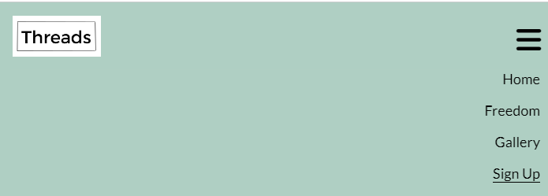
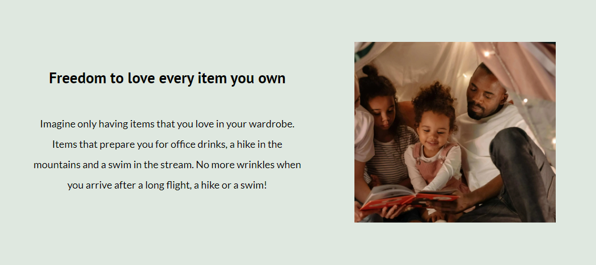
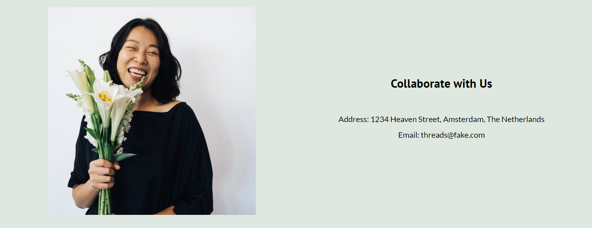
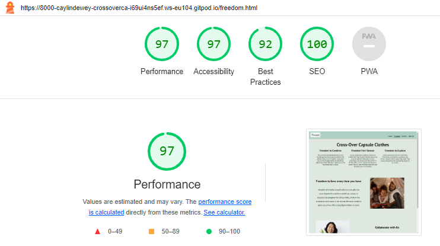

# Threads
Threads is intended to provide support for professionals, too busy living life to worry about what they should wear. The site targets people who want to maximise their freedom of living, and to minimise stress of dressing for it.

In the sign up form, a brochure can be requested with all the details for ordering. This will ensure that marketing can be optimised with carefully targeted campaigns - avoiding information overload for our customers. 

The site is responsive to viewing on mobiles, tablets, laptops, and desktops. Please see 

 View Threads Cross-over Capsule live project [here](https://caylindewey.github.io/cross-over-capsule-102/).

- - -

# Table of Contents
## [User Experience](#user-experience-1)
### [User Stories UX](#user-stories-ux-1)
#### [First Time Visitor Goals](#first-time-visitor-goals-1) 
#### [Returning Visitor Goals](#returning-visitor-goals-1)
#### [Frequent Visitor Goals](#frequent-visitor-goals-1)
## [Features](#features-1)
### [Existing Features](#existing-features-1)
#### [Navigation Bar](#navigation-bar-1)
#### [Footer Page](#footer-page-1)
#### [Main Headings](#main-headings-1)
##### [Home Page](#home-page-1)
##### [Freedom Page](#freedom-page-1)
##### [Gallery Page](#gallery-page-1)
##### [Signup Page](#signup-page-1)
### [Features Left to Implement](#features-left-to-implement-1)
## [Design](#design-1)
### [Color Scheme](#color-scheme-1)
### [Typography](#typography-1)
### [Wireframes](#wireframes-1)
## [Technologies Used](#technologies-used-1)
## [Frameworks, Libraries and Programs](#frameworks-libraries-and-programs-1)
## [Testing](#testing-1)
### [Validator Results](#validator-results-1)
### [Manual Testing](#manual-testing-1)
### [Lighthouse Testing](#lighthouse-testing-1)
## [Deployment and Local Development](#deployment-and-local-development-1)
#### [How to Deploy](#how-to-deploy-1)
#### [How to Fork](#how-to-fork-1)
#### [How to Clone](#how-to-clone-1)
## [Credits](#credits-1)
### [Code and Media](#code--media-1)
### [Content](#content-1)
## [Acknowledgements](#acknowledgements-1)

# Threads - Cross-over Capsule Wardrobe
## User Experience

- An user-centered approach was taken with the design of a lean, simple and elegant site.
- The user should be able to get the lay of the land within a glance.
- The site should be future-proofed to accomodate scalability but keep the navigation of the site consistent for the user - regardless of growth and expansion
- A cautionary note: minimalism is understood to discourage buying activities. The focus for this site to be successful, needs to provide the type of product that brings more joy to the user, than its predecessors and even competitors.
- The image of a smiling woman with lillies was repeated to amplify this focus.

### User Stories UX

#### First Time Visitor Goals
- The visitor is introduced to the idea of going to the wardrobe knowing what to wear anywhere, anytime on the landing page. 
- The site is easy to navigate.  The layout is simple (no decision fatigue or information overload).
- A signup page provides the application for a brochure.

#### Returning Visitor Goals
- Find more information about the company.
- Review new concepts on the Freedom page and new styles on the gallery page.
- Request an updated brochure if the targeted marketing campaign has not sent one yet.

#### Frequent Visitor Goals
- As the product range and technology expands, new concepts can be loaded on the freedom page.
- New styles and looks can be loaded on the gallery page.
- The visitor should always have options to replace older items with newer items that give more joy.

- - -
## Features
- The site is responsive on all device sizes.
- The site entices people who want to an easy way of dressing to fill in the sign up page.
- This client information can then be used for targeted marketing campaigns as the business scales up and expands.

### Existing Features
#### Navigation Bar
- It includes all pages (home, freedom, gallery and sign up page).
- It is fixed for visibility from all pages giving you easy access going forward or backward.  You can also easily access any page on the site from here.
- The design is identical on all pages, promoting continuity and ease of use (trust).
- The page you are on is underlined promoting transparency (belonging).

On the mobile device the navigation bar folds into a burger icon with a drop down menu. 

#### Footer Page
- Links to social meadia are given for the user.  This opens a new tab for easy navigation.

#### Main Headings
The logo has been incorporated with the heading in keeping with the product philosophy of having less do more for you.

##### Home Page
The heading has been suggested as an idea (white transparent cloud around text) of looking at your wardrobe and knowing what to wear anytime, anywhere.

##### Freedom Page
Cross-Over Capsule Clothes explains the hybrid concept of this range giving the user freedom.  The minamilistic idea is promoted in the sense the the user is free to experience life more with less stress of dressing for each occasion.

- Section One
In keeping with the ideas in which way the user will be free to experience life, these sections suggest various scenarios where life can be experienced more with joy wearing the cross-over capsule wardrobe.

- Section Two
Here the user has a more spaced out layout to take a moment and savour the experiences with our clothes. Minimalism often promotes buying less.  This site promotes buying to experience more joy from the new items.

- Section Three
The user is invited to collaborate with us.  The contact details are given next to an image of a smiling modern girls with a huge bunch of lillies.

##### Gallery Page
The idea that the user can simplify life and enjoy it more is suggested by the images.
- Sign Up for a brochure now! is encapsulated in the white border again to promote the idea of signing up.  Only 3 fields make the task seem small.

##### Signup Page
The signup heading invites the user to take action now by signing up.

- - - 

### Features Left to Implement
- In future all new concepts can be updated on the freedom page. A blog can also be added featuring articles and product tests from influencers.
- The gallery page can display the latest products.
- The signup page can be expanded to give an option to have a newsletter subscription.

- - -

## Design
### Color Scheme
The following palette was selected from [My Color Space](https://mycolor.space/)

### Typography
- The Lato family of fonts was chosen from [Google Fonts](https://fonts.google.com) with sans-serif in case it doesn't import.

### Wireframes
- [FigmaJam](https://www.figma.com/) was used to create wireframes that will scale up easily for teamwork. 
- The site has been designed with an "easy to take in" style focussed on avoiding decision fatigue and information overload. The underlined navigation items tells you where you are.  
- Each stroke and click is efficient and intentional.
 

- - -

## Technologies Used
### Language
- HTML and CSS was used

- - - 

## Frameworks, Libraries and Programs
- [Git](https://git-scm.com/) was used for version control
- [Github](https://github.com/) wa used to save and store files
- [Lightshot](https://app.prntscr.com/en/index.html) was used for screendumps

- - - 

## Testing
The W3C HTML Validator and W3C CSS Validator were used to check that there wer no error.

- [W3C HTML Validtor](https://validator.w3.org/)
- [W3C CSS Validtor](https://jigsaw.w3.org/css-validator/)

### Validator Results 

index.html

freedom.html

Gallery.html

signup.html

style.css

### Manual Testing
- The website was tested on Opera, Google Chrome, and Microsoft Edge.
- The website was viewed on a desktop, tablet, and Samsung Galaxy A33 mobile phone.
- Chrome Dev Tools were used to ensure the site was responsive to various screen sizes.
- All links work on these sites and the site was responsive to all the screen sizes.

### Lighthouse Testing
#### Results

Home Page Desktop Results

Home Page Mobile Results

Freedom Page Desktop Results

Freedom Page Mobile Results

Gallery Page Desktop Results

Gallery Page Mobile Results

Signup Page Desktop Results

Signup Page Mobile Results

 
- - -

## Deployment and Local Development

### How to Deploy 
Github was used to deploy this site.  The steps are as follows:
1. Log into the [Github site](https://github.com/)
2. Pull up the repository for [Cross-over Capsule](https://github.com/CaylinDewey/cross-over-capsule-102)
3. Select the settings link, then the pages link.
4. In the source section choose 'main' from the dropdown menu.  
5. Select the 'root' from the drop menu and 'save'.
6. The URL that is displayed should have your live Github pages site. 

### How to Fork
1. Log into the [Github site](https://github.com/)
2. Pull up the repository for [Cross-over Capsule](https://github.com/CaylinDewey/cross-over-capsule-102)
3. Use to [fork button](assets/images/github_fork.png) on the top right hand corner 

### How to Clone
1. Log into the [Github site](https://github.com/)
2. Click on the burger menu that will open up the repositories you are working on at the bottom.  Select the project you need.
3. Click on the clone button and select from HTTPS, SSH, or GitHub CLI.  Then copy the link shown.
4. Open your code editor terminal and change the current work directory to the location you want to use for the cloned directory.
5. Type in the terminal 'git clone' and paste your link here. 

- - - 

## Credits
### Code and Media
- [Am I Responsive](https://ui.dev/amiresponsive) displays the site on a range of devices.
- [Code Institute Readme Template](Code-Institute-Solutions/readme-template) 
- [Code Institue Alumna's, Kera Cudmore, Readme Tutorial](https://github.com/kera-cudmore)
- [Favicon](https://favicon.io/favicon-converter/) was used to create the favicon
- [Figjam](https://www.figma.com/) was used for the wireframe
- [Font Awesome](https://fontawesome.com/v4/icons/) was used for all icons 
- [Pexels](https://www.pexels.com/) was used to source all images
- [Tinypng](https://tinypng.com/) was used to compress all images
- [Free Convert](https://www.freeconvert.com/download) was used to convert all images to web pages

### Content
- All content was written by Caylin Dewey

 - - -

## Acknowledgements
- My mentor Mitko Bachvarov provided helpful feedback and advice.
- Slack community provided solutions and feedback.
- Code Institute tutors were quick to respond to my problems and to assist me with very little fuss.

